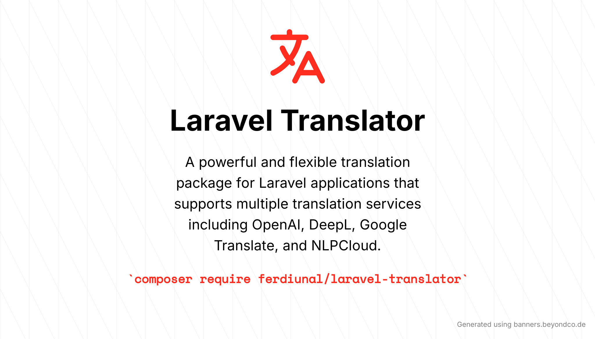

# Laravel Translator

A powerful and flexible translation package for Laravel applications that supports multiple translation services including OpenAI, DeepL, Google Translate, and NLPCloud.

## Installation

```bash
composer require ferdiunal/laravel-translator
```

## Configuration

First, publish the configuration file:

```bash
php artisan vendor:publish --provider="Ferdiunal\LaravelTranslator\LaravelTranslatorServiceProvider"
```

This will create a `config/translator.php` file in your app that you can modify to set your configuration. You can configure the following settings:

```php
return [
    'deepl' => [
        'api_key' => env('DEEPL_API_KEY'),
    ],

    'nlpCloud' => [
        'api_key' => env('NLPCLOUD_API_KEY'),
        'model' => env('NLPCLOUD_MODEL', 'nllb-200-3-3b'),
        'languages' => [
            'az' => 'azj_Latn',
            'de' => 'deu_Latn',
            'en' => 'eng_Latn',
            'es' => 'spa_Latn',
            'it' => 'ita_Latn',
            'pt' => 'por_Latn',
            'tr' => 'tur_Latn',
            'ru' => 'rus_Cyrl',
        ],
    ],

    'openai' => [
        'api_key' => env('OPENAI_API_KEY'),
        'base_url' => env('OPENAI_BASE_URL', 'https://api.openai.com/v1'),
        'model' => env('OPENAI_MODEL', 'gpt-4'),
        'messages' => [
            [
                'role' => 'system',
                'content' => 'You are an assistant who translates the text from English to Turkish. Just return the translated output.',
            ],
        ],
    ],
];
```

Add the following environment variables to your `.env` file based on the services you want to use:

```env
# DeepL Configuration
DEEPL_API_KEY=your-deepl-api-key

# NLPCloud Configuration
NLPCLOUD_API_KEY=your-nlpcloud-api-key
NLPCLOUD_MODEL=nllb-200-3-3b

# OpenAI Configuration
OPENAI_API_KEY=your-openai-api-key
OPENAI_BASE_URL=https://api.openai.com/v1
OPENAI_MODEL=gpt-4
```

## Available Translation Services

### Google Translate

To use Google Translate, install the required package:

```bash
composer require stichoza/google-translate-php
```

### DeepL Translate

To use DeepL Translate, install the required package and set up your API key:

```bash
composer require deeplcom/deepl-php
```

### OpenAI Translate

To use OpenAI's translation capabilities, install the official PHP package:

```bash
composer require openai/openai-php
```

### NLPCloud Translate

To use NLPCloud's translation service, install their client package:

```bash
composer require nlpcloud/nlpcloud-client
```

## Usage

### Basic Usage

```php
use Ferdiunal\LaravelTranslator\Facades\Translator;

// Translate a single text
$translatedText = Translator::translate('Hello World', 'tr');

// Translate multiple texts
$translations = Translator::translate(['Hello', 'World'], 'tr');

// Specify source language
$translatedText = Translator::from('en')->translate('Hello World', 'tr');

// Use specific translation service
$translatedText = Translator::using('openai')->translate('Hello World', 'tr');
$translatedText = Translator::using('deepl')->translate('Hello World', 'tr');
$translatedText = Translator::using('nlpcloud')->translate('Hello World', 'tr');
```

### Working with Laravel Collections

```php
use Ferdiunal\LaravelTranslator\Facades\Translator;

$collection = collect([
    'title' => 'Hello World',
    'description' => 'This is a description',
]);

// Translate all values in a collection
$translatedCollection = $collection->map(function ($text) {
    return Translator::translate($text, 'tr');
});
```

### Blade Integration

```php
{{-- Basic translation directive --}}
{{ translate('Hello World', 'tr') }}

{{-- Use specific translation service --}}
{{ translate('Hello World', 'tr', 'openai') }}
```

## License

The MIT License (MIT). Please see [License File](LICENSE) for more information.
