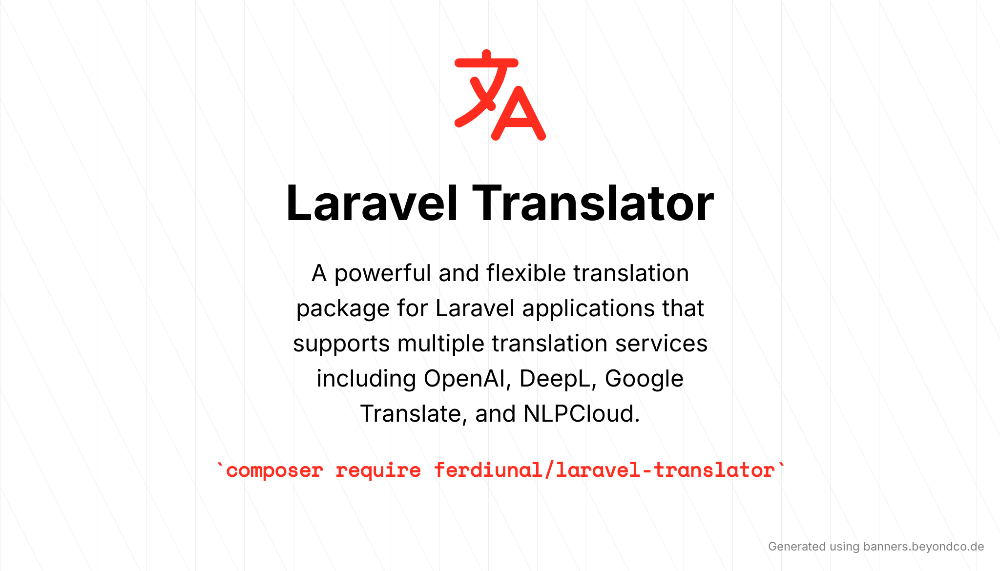

# Laravel Translator

Laravel uygulamaları için çoklu provider destekli, type-safe ve genişletilebilir çeviri paketi.

Desteklenen provider’lar:

- Google Translate
- Bing Translator
- DeepL
- MyMemory
- NLP Cloud
- OpenAI / OpenAI uyumlu custom base URL’ler

## Gereksinimler

- PHP `^8.2` — PHP 8.4+ ve 8.5 CI matrix ile doğrulanır.
- Laravel 10, 11 veya 12.

## Kurulum

```bash
composer require ferdiunal/laravel-translator
```

Config dosyasını yayınla:

```bash
php artisan vendor:publish --provider="Ferdiunal\LaravelTranslator\LaravelTranslatorServiceProvider"
```

## Temel kullanım

```php
use Ferdiunal\LaravelTranslator\LaravelTranslator;

$translated = LaravelTranslator::translate(
    translator: 'google',
    source: 'en',
    target: 'tr',
    text: 'Hello World',
);
```

Facade:

```php
use Ferdiunal\LaravelTranslator\Facades\LaravelTranslator;

$translated = LaravelTranslator::translate('openai', 'en', 'tr', 'Hello World');
```

Helper:

```php
$translated = translator('deepl', 'en', 'tr', 'Hello World');
```

Provider instance çözmek:

```php
$provider = LaravelTranslator::translator('mymemory');
$translated = $provider->run('en', 'tr', 'Hello :name');
```

`run()` Laravel placeholder’larını korur. Örneğin `:name`, `:count` gibi placeholder’lar çevrilmez; e-posta içindeki `@` gibi karakterler bozulmaz.

## Provider anahtarları ve alias’lar

Canonical provider key’leri:

| Provider | Canonical key | Eski/uyumlu alias |
| --- | --- | --- |
| Google | `google` | - |
| Bing | `bing` | - |
| DeepL | `deepl` | - |
| MyMemory | `mymemory` | `myMemory` |
| NLP Cloud | `nlpcloud` | `nlpCloud` |
| OpenAI | `openai` | - |

Acronym/case farkları artık runtime class-name tahminiyle çözülmez. Provider çözümleme explicit registry üzerinden yapılır; bu yüzden Linux/PSR-4 case-sensitive ortamlarda `OpenAI`, `DeepL`, `NLPCloud`, `MyMemory` gibi isimler kırılgan değildir.

Aktif provider listesini almak:

```php
$providers = LaravelTranslator::providers();
```

## Config

Yayınlanan `config/translator.php` özetle şu alanları içerir:

```php
return [
    'fallback' => [
        'throw' => env('TRANSLATOR_THROW_ON_FAILURE', false),
    ],

    'http' => [
        'timeout' => (int) env('TRANSLATOR_HTTP_TIMEOUT', 10),
        'connect_timeout' => (int) env('TRANSLATOR_HTTP_CONNECT_TIMEOUT', 5),
        'retry_times' => (int) env('TRANSLATOR_HTTP_RETRY_TIMES', 1),
        'retry_sleep_ms' => (int) env('TRANSLATOR_HTTP_RETRY_SLEEP_MS', 100),
    ],

    'providers' => [
        // Built-in provider disable örneği:
        // 'openai' => ['enabled' => false],
    ],

    'deepl' => [
        'api_key' => env('DEEPL_API_KEY'),
    ],

    'nlpcloud' => [
        'api_key' => env('NLPCLOUD_API_KEY'),
        'model' => env('NLPCLOUD_MODEL', 'nllb-200-3-3b'),
    ],

    'openai' => [
        'api_key' => env('OPENAI_API_KEY'),
        'base_url' => env('OPENAI_BASE_URL', 'https://api.openai.com/v1'),
        'model' => env('OPENAI_MODEL', 'gpt-4o-mini'),
    ],
];
```

Paket default olarak secret/API key göndermez. API key’leri `.env` üzerinden verilmelidir.

```env
DEEPL_API_KEY=your-deepl-api-key
NLPCLOUD_API_KEY=your-nlpcloud-api-key
NLPCLOUD_MODEL=nllb-200-3-3b
OPENAI_API_KEY=your-openai-api-key
OPENAI_BASE_URL=https://api.openai.com/v1
OPENAI_MODEL=gpt-4o-mini
```

## Custom provider ekleme

Custom provider sınıfı `Ferdiunal\LaravelTranslator\Translators\Translator` sınıfını extend etmelidir.

```php
<?php

declare(strict_types=1);

namespace App\Translators;

use Ferdiunal\LaravelTranslator\Translators\Translator;

final class AcmeTranslator extends Translator
{
    public function handle(string $source, string $target, string $text): string
    {
        return "[$source>$target] $text";
    }

    public function icon(): string
    {
        return 'https://example.com/icon.svg';
    }

    public function key(): string
    {
        return 'acme';
    }

    public function title(): string
    {
        return 'Acme';
    }

    /** @return array{icon: string, key: string, title: string} */
    public function toArray(): array
    {
        return [
            'icon' => $this->icon(),
            'key' => $this->key(),
            'title' => $this->title(),
        ];
    }
}
```

`config/translator.php`:

```php
'providers' => [
    'acme' => [
        'driver' => App\Translators\AcmeTranslator::class,
        'enabled' => true,
        'title' => 'Acme',
        'icon' => 'https://example.com/icon.svg',
        'aliases' => ['legacyAcme'],
    ],
],
```

Kullanım:

```php
$translated = LaravelTranslator::translate('acme', 'en', 'tr', 'Hello');
```

## Provider disable/override

Built-in provider’ı kapatmak:

```php
'providers' => [
    'openai' => [
        'enabled' => false,
    ],
],
```

Built-in provider metadata veya driver override etmek:

```php
'providers' => [
    'openai' => [
        'driver' => App\Translators\CustomOpenAITranslator::class,
        'title' => 'Company OpenAI Proxy',
        'default_base_url' => 'https://ai.example.com/v1',
        'enabled' => true,
    ],
],
```

Geçersiz custom provider sınıfı `InvalidTranslatorProviderException`, bilinmeyen/disabled provider ise `UnsupportedTranslatorException` fırlatır.

## OpenAI uyumlu endpoint kullanımı

OpenAI provider, `OPENAI_BASE_URL` ile OpenAI-compatible endpoint’leri destekler:

```env
OPENAI_API_KEY=your-api-key
OPENAI_BASE_URL=https://openrouter.ai/api/v1
OPENAI_MODEL=openai/gpt-4o-mini
```

## Test ve kalite gate’leri

```bash
composer validate --strict
composer format:check
composer analyse
composer test -- --ci
```

Tek komut:

```bash
composer ci
```

CI matrix PHP 8.2/8.3/8.4/8.5 ve Laravel 10/11/12 kombinasyonlarını kapsayacak şekilde tasarlanmıştır.

## License

The MIT License (MIT). Please see [License File](LICENSE) for more information.
